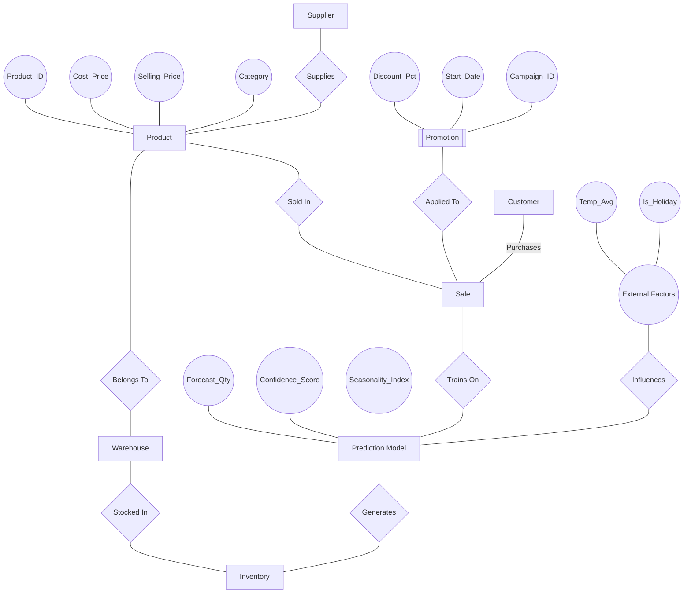

# Smart_Retail_Predictor
AI-driven demand forecasting and inventory management system

```mermaid
graph TD
    %% Entities (Rectangles)
    Product[Product]
    Inventory[Inventory]
    Sale[Sale]
    Customer[Customer]
    Supplier[Supplier]
    Promotion[[Promotion]]
    Weather_Data((External Factors))
    ML_Model[Prediction Model]
    Warehouse[Warehouse]

    %% Relationships (Diamonds)
    Belongs_To{Belongs To}
    Stocked_In{Stocked In}
    Sold_In{Sold In}
    Applied_To{Applied To}
    Influences{Influences}
    Trains_On{Trains On}
    Generates{Generates}
    Supplies{Supplies}

    %% Attributes - Product (Ovals)
    p1((Product_ID)) --- Product
    p2((Cost_Price)) --- Product
    p3((Selling_Price)) --- Product
    p4((Category)) --- Product

    %% Attributes - Prediction (Ovals)
    f1((Forecast_Qty)) --- ML_Model
    f2((Confidence_Score)) --- ML_Model
    f3((Seasonality_Index)) --- ML_Model

    %% Attributes - Promotion (Ovals)
    pr1((Discount_Pct)) --- Promotion
    pr2((Start_Date)) --- Promotion
    pr3((Campaign_ID)) --- Promotion

    %% Attributes - External (Ovals)
    w1((Temp_Avg)) --- Weather_Data
    w2((Is_Holiday)) --- Weather_Data

    %% Connecting the Logic
    Supplier --- Supplies --- Product
    Product --- Belongs_To --- Warehouse
    Warehouse --- Stocked_In --- Inventory
    Product --- Sold_In --- Sale
    Promotion --- Applied_To --- Sale
    Customer ---|Purchases| Sale
    
    %% The Smart Feedback Loop
    Sale --- Trains_On --- ML_Model
    Weather_Data --- Influences --- ML_Model
    ML_Model --- Generates --- Inventory
```
